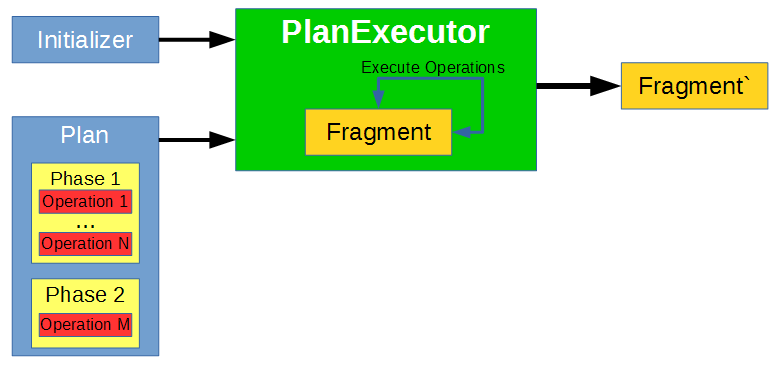

The PlanExecutor is a simple workflow engine which is able to execute plans. The plan is separated by phases which consist of Operations. The other input of the PlanExecutor is one of the `Initializer` interface implementation. `Initializer` shall initialize the Fragment object and it is able to store extra information for phases and operations. During the execution operations working on the shared object, called fragment. The output of the process is the fragment.



## Building blocks

### Fragment

The fragment represents the artefact that the executor is operating on. In the [[CPS model generator|CPS-Model-Generator]], the fragment refers to the CPS instance model that is built. The fragment is introduced as a type parameter to ensure that operations can call the methods in a type-safe way on the fragment object.

### Initializer

The initializer is responsible for creating an initial fragment object at the start of the execution. This approach allows the creation of the initializer object without performing possible expensive processing for creating the fragment before it is required.

```xtend
interface Initializer<FragmentType> {
	def FragmentType getInitialFragment();
}
```

### Operation

Operations are defined for a given fragment type and are executed as part of phases. The same operation implementation may be used in multiple phases. The operation receives the fragment object as a parameter when it is executed.

```xtend
interface IOperation<FragmentType> {
	def boolean execute(FragmentType fragment);
}
```

### Phase

Phases represent standalone execution steps that define a list of operations on the same fragment type. The phase receives the fragment object as a parameter when assembling the operations, which means that the operation list can be dependent of the current state of the fragment.

```xtend
interface IPhase<FragmentType> {
	def Iterable<IOperation<FragmentType>> getOperations(FragmentType fragment);
}
```

### Plan

The plan is created by adding phases that were already prepared by the same fragment. During the execution, the list of phases are requested by the executor.

```xtend
interface IPlan<FragmentType> {
	def void addPhase(IPhase<FragmentType> phase);
	def Iterable<IPhase<FragmentType>> getPhases();
}
```

## Technical details

First step is to create custom implementations of `IPlan`, `IPhase`, `IOperation`, `Initializer` interfaces and create the `Fragment` type like in the followings.

**MyFragment**:
```xtend
class MyFragment {
	SecretStore secretStore = "";

	def addSecretInformation(String info) {
		secretStore.add(info);
	}

	def encryptStore() {
		secretStore.encrypt;
	}
	
	def print() {
		secretStore.print;
	}
}
```
**MyInitializer**:
```xtend
class MyInitializer implements Initializer<MyFragment> {
	
	override getInitialFragment() {
		return new MyFragment();
	}
	
}
```

**MyPlan**:
```xtend
class MyPlan implements IPlan<MyFragment> {
	
	List<IPhase<MyFragment>> phases = Lists.newArrayList;
	
	override addPhase(IPhase<MyFragment> phase) {
		phases.add(phase);
	}
	
	override getPhases() {
		return phases;
	}
	
}
```

**MyPhase**:
```xtend
class MyPhase implements IPhase<MyFragment>{
	
	override getOperations(MyFragment fragment) {
		Lists.newArrayList(
                   new AddSecretOperation(),
                   new EncryptStoreOperation(),
                );
	}
	
}
```

**AddSecretOperation**:
```xtend
class AddSecretOperation implements IOperation<MyFragment> {
	
	override execute(MyFragment fragment) {
		fragment.addSecretInformation("My Secret Information");	
		return true;
	}
	
}
```

**EncryptStoreOperation**:
```xtend
class EncryptStoreOperation implements IOperation<MyFragment> {
	
	override execute(MyFragment fragment) {
		fragment.encryptStore;	
		return true;
	}
	
}
```

***


Second step is to build plan and the initializer.
```xtend
class Example {
	def static void main(String[] args) {
		var MyPlan plan = new MyPlan;
		plan.addPhase(new MyPhase());
		plan.addPhase(new MyOtherPhase());

		var MyInitializer initializer = new MyInitializer;
	}
}
```

***

The last step is to instantiate correct `PlanExecutor` and call the `process` method.
```xtend
class Example {
	def static void main(String[] args) {
		var MyPlan plan = new MyPlan;
		plan.addPhase(new MyPhase());
		plan.addPhase(new MyOtherPhase());

		var MyInitializer initializer = new MyInitializer;

		var PlanExecutor<MyFragment, MyInitializer> planExecutor = new PlanExecutor();
		var output = planExecutor.process(plan, initializer);

		output.print;
	}
}
```
